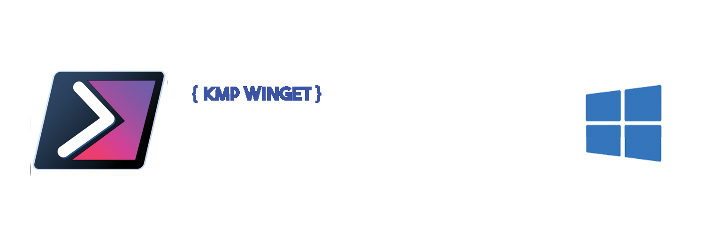
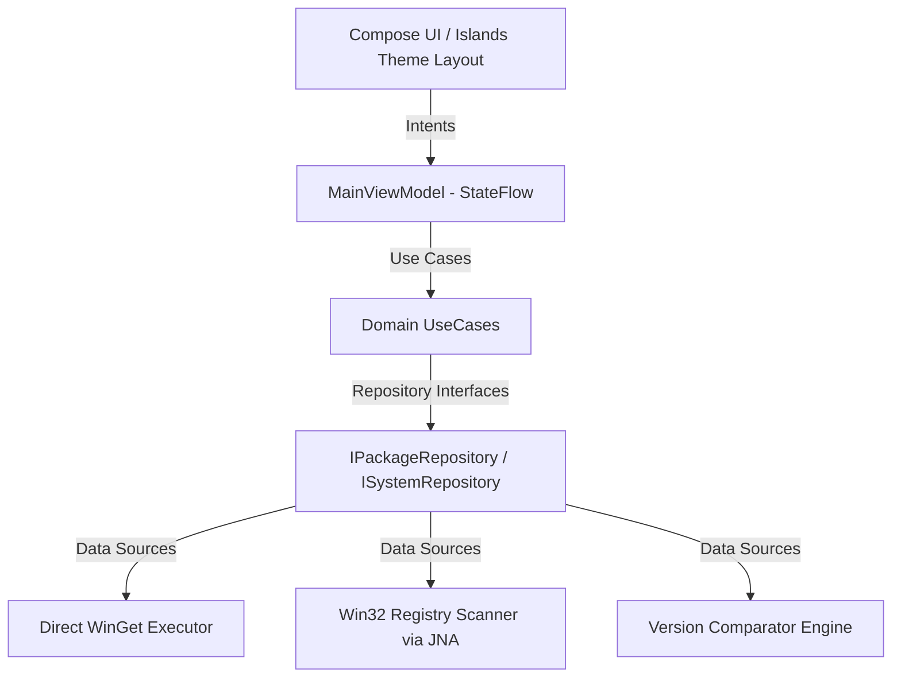

# KMP WinGet Package Manager (Windows)

A modern, high-performance Windows Package Manager built with **Kotlin Multiplatform (Compose Desktop)** and updated **Material Design 3 with an Islands Architecture**. Features a luminous tab underglow, clean table layouts, Clean Architecture (MVI), fast direct process execution, and seamless package management for Windows 10/11.

[](https://github.com/StarkDroid/kmp-winget)


## ✨ Modern Features & Highlights

- 🏝️ **"Islands" Theme Layout**: Structured into clean, elevated Island containers (Header Island, Nav & Controls Island, Main Table Island, System Tools Island) rather than repetitive individual card boxes.
- ✨ **Luminous Tab Underglow**: Selected navigation tabs feature a soft, aesthetic neon underglow beam with dynamic status indicators.
- ⚡ **High-Performance Direct Process Engine**: Direct non-blocking WinGet CLI execution with streamable output logs and JNA Win32 Registry scanner for instantaneous initial load times (<30ms).
- 🔄 **Local & Non-WinGet App Updates**: Intelligent semantic version comparator and WinGet catalog resolver that automatically detects and triggers updates for apps installed via EXE, MSI, or Add/Remove Programs.
- 🗑️ **Safe & Batch Operations**: Multi-select mode with safety confirmation modals to upgrade or uninstall multiple applications in batch.
- 🔍 **Real-Time Search & Smart Filtering**: Instant debounced search by name, ID, publisher, with filters by source (`winget`, `msstore`, `local`) and multi-criteria sorting.
- 🧹 **System & Maintenance Dashboard**: Real-time storage drive breakdown (C:, D:, etc.), one-click Windows Disk Cleanup launcher, and WinGet source/cache optimization.
- 🌗 **Adaptive Material 3 Dark/Light Theming**: Clean single-switch theme toggle with smooth animation and native Windows title bar synchronization.
- 📜 **Live Operation Terminal**: Real-time live log drawer in operation dialogs to view stdout/stderr streaming from package management operations.

---

## 🏗️ Architecture & Best Practices

The app follows **Clean Architecture & MVI (Model-View-Intent)** principles with unidirectional data flow:


```mermaid
graph TD
    UI[Compose UI / Islands Theme Layout] -->|Intents| VM[MainViewModel - StateFlow]
    VM -->|Use Cases| UC[Domain UseCases]
    UC -->|Repository Interfaces| Repos[IPackageRepository / ISystemRepository]
    Repos -->|Data Sources| DS1[Direct WinGet Executor]
    Repos -->|Data Sources| DS2[Win32 Registry Scanner via JNA]
    Repos -->|Data Sources| DS3[Version Comparator Engine]
```

- **Domain Layer**: Clean business entities (`Package`, `PackageFilter`, `SystemStats`, `OperationResult`, `VersionComparator`), use cases (`GetPackagesUseCase`, `UpgradePackageUseCase`, `UninstallPackageUseCase`, `BatchOperationUseCase`, `SystemToolsUseCase`).
- **Data Layer**: Direct process executor (`WinGetExecutor`), robust positional column parser (`WinGetParser`), JNA Win32 Registry scanner (`WindowsRegistryScanner`), and Windows Native Bridge (`WindowsNativeBridge`).
- **Presentation Layer**: Compose Multiplatform Desktop with Material 3 Islands theme, glowing tab underglow, and reactive ViewModel state flows.
- **Dependency Injection**: Koin 4.x.

---

## 🚀 Getting Started

### Prerequisites
- Windows 10 (version 1809+) or Windows 11.
- [WinGet (Windows Package Manager CLI)](https://learn.microsoft.com/en-us/windows/package-manager/winget/) (pre-installed on modern Windows 10/11).
- JDK 17+.

### Run Locally

```bash
# Clone the repository
git clone https://github.com/StarkDroid/kmp-winget
cd kmp-winget

# Run the desktop application
./gradlew run
```

### Build Distribution (.exe / .msi)

```bash
./gradlew packageDistributionForCurrentOS
```

---

## 🛠️ Tech Stack

- **Framework**: Kotlin Multiplatform (Compose Desktop 1.7.3)
- **Language**: Kotlin 2.1.10
- **Native Windows Interop**: JNA 5.16.0 (Win32 dwmapi, Advapi32, User32)
- **Dependency Injection**: Koin 4.0.3 (`koin-compose-viewmodel`)
- **State & Async**: Kotlin Coroutines 1.10.1 & StateFlow
- **Design System**: Material Design 3 with Islands Layout & Luminous Tab Underglow

---

## 📄 License

Distributed under the MIT License. See `LICENSE` for more information.
