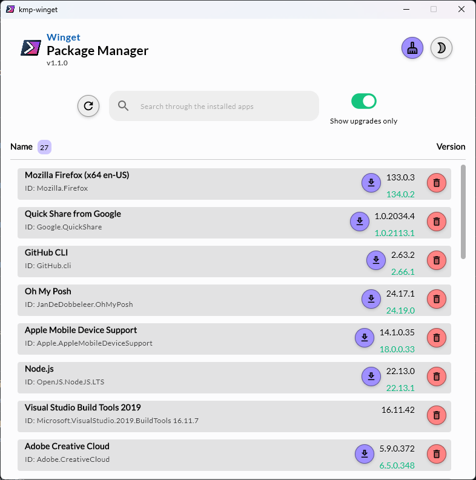
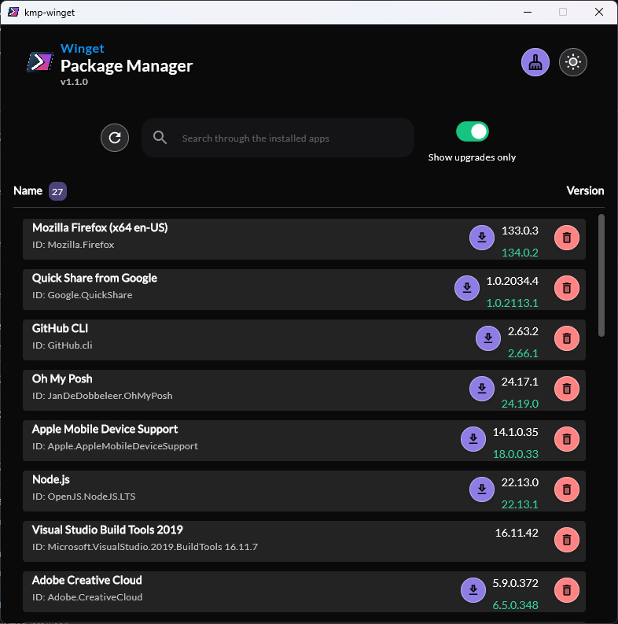

# KMP Winget Package Manager (Windows)

A Material theme based package manager crafted for Windows desktop app with the help of Kotlin Multi-Platform and Compose UI, that lets you list, search, upgrade or uninstall packages installed in your system that runs on winget commands in the background. As a bonus, also lets you perform disc cleanup.

[](https://github.com/StarkDroid/kmp-winget)


## Environment Dependency

To run this project, you will need winget installed in your windows 10 machine.
To know more, follow this [link](https://learn.microsoft.com/en-us/windows/package-manager/winget/)


## Screenshots





## Run Locally

It's recommended to use [IntelliJ Idea IDEA](https://www.jetbrains.com/idea/) to run the project

Clone the project

```bash
  git clone https://github.com/StarkDroid/kmp-winget
```

Go to the project directory

```bash
  cd kmp-winget
```

Run the app

```bash
  ./gradlew run
```

To build an installable (.msi) package

```bash
  ./gradlew packageDistributionForCurrentOS
```
or you can simply visit the [release]() page to get the latest build


## Features

- Light/dark mode toggle
- List all the installed apps
- Displays the number of apps
- Shows installed version of the app
- Shows available updates for an app
- One click solution to disc cleanup
- Search and filter among the list of apps
- Ability to upgrade an app to its available update
- Ability to uninstall an app
- Dialog Loader popup

## Tech Stack

**Interface:** Kotlin Multi-Platform, Compose Views, Material UI

**Services:** Winget-CLI

**Platform:** Windows 10/11

## Contributors

<a href="https://github.com/StarkDroid/kmp-winget/graphs/contributors">
  
</a>

Made with [contrib.rocks](https://contrib.rocks).

